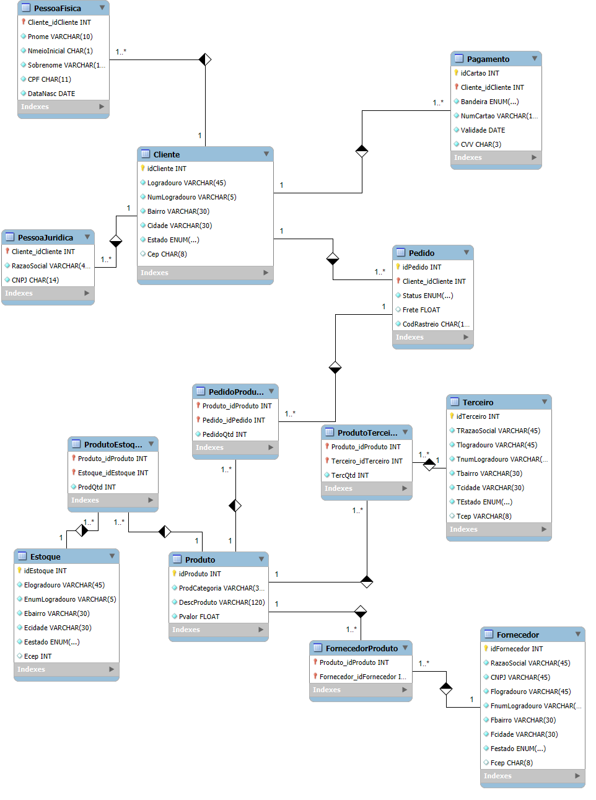

# E-commerce Database Project

## Objetivo do Projeto
O objetivo deste projeto é criar um banco de dados robusto e eficiente para gerenciar as operações de um e-commerce, permitindo o armazenamento, consulta e análise de dados relacionados a clientes, pedidos, produtos, estoque, fornecedores e terceiros. Além de garantir a integridade e organização dos dados, o projeto também visa responder a perguntas estratégicas que podem fornecer insights valiosos para a operação do e-commerce.

## Mini-Mundo
A empresa Ecommerce XPTO, especializada na venda de produtos diversos como eletrônicos, roupas e utensílios domésticos, enfrentava desafios na organização e análise de seus dados operacionais. Para superar esses desafios, identificou-se a necessidade de uma solução de banco de dados que fosse capaz de integrar informações sobre clientes, produtos, fornecedores, pedidos e estoques de forma eficiente e escalável. Essa base de dados deveria atender a requisitos como:

1. **Gerenciamento de Clientes:** Registrar informações de clientes, diferenciando pessoas físicas de pessoas jurídicas, além de acompanhar seu histórico de pedidos.
2. **Controle de Produtos:** Monitorar o catálogo de produtos, incluindo descrição, categoria e preço.
3. **Gestão de Pedidos:** Rastrear os pedidos realizados, armazenando detalhes como status do pedido, produtos comprados e quantidades.
4. **Controle de Estoques:** Acompanhar as quantidades disponíveis em diferentes centros de distribuição e os estoques mantidos por terceiros.
5. **Relacionamento com Fornecedores:** Gerenciar os fornecedores responsáveis pelo abastecimento de produtos.
6. **Logística Terceirizada:** Integrar informações de empresas terceirizadas que auxiliam na logística e armazenagem.

Com essas diretrizes, foi desenvolvido um banco de dados relacional que possibilita consultas detalhadas e análise estratégica, proporcionando maior eficiência e suporte à tomada de decisão.

## Escopo
O projeto abrange:
- **Modelo Conceitual:** Criação de uma estrutura lógica representando as entidades e seus relacionamentos.
- **Modelo Físico:** Implementação do modelo conceitual no sistema de gerenciamento de banco de dados (MySQL).
- **Consultas Analíticas:** Desenvolvimento de queries SQL para extrair informações estratégicas e gerar insights para a tomada de decisão.
## Estrutura do Banco de Dados
Com a necessidade de mapear as entidades, bem como o relacionamento entre elas, foi desenvolvido o Diagrama de Entidade e Relacionamento para facilitar o desenvolvimento do banco de dados:




## Estrutura do Banco de Dados
O banco de dados foi nomeado como `ecommerce` e contém as seguintes tabelas principais:

### Entidades Principais
1. **Cliente**
   - Dados cadastrais de clientes, divididos em Pessoas Físicas e Jurídicas.
2. **Produto**
   - Detalhes dos produtos comercializados.
3. **Pedido**
   - Informações sobre pedidos realizados pelos clientes.
4. **Estoque**
   - Localizações e quantidades de produtos disponíveis nos centros de distribuição.
5. **Fornecedor**
   - Dados dos fornecedores dos produtos.
6. **Terceiro**
   - Informações sobre empresas terceirizadas que auxiliam na logística ou serviços relacionados.

### Tabelas Associativas
1. **PedidoProduto**
   - Relaciona pedidos aos produtos e suas respectivas quantidades.
2. **ProdutoEstoque**
   - Relaciona produtos aos centros de estoque e suas quantidades.
3. **ProdutoFornecedor**
   - Relaciona produtos aos fornecedores.
4. **ProdutoTerceiro**
   - Relaciona produtos às empresas terceirizadas e quantidades armazenadas.

### Detalhes Técnicos
- Uso de constraints para garantir a integridade referencial.
- Utilização de tipos de dados adequados, como `ENUM` para campos com valores fixos e `VARCHAR` para texto variável.
- Índices e chaves primárias para otimizar a performance das consultas.

## Inserções de Dados
Foi inserido um conjunto de dados fictícios para representar:
- Clientes (Pessoas Físicas e Jurídicas).
- Pedidos realizados com status variados ("Pedido recebido", "Enviado", etc.).
- Produtos em diferentes categorias ("Roupas", "Eletrônicos", etc.).
- Estoques e fornecedores para os produtos.

## Consultas Desenvolvidas
O banco de dados foi projetado para responder a perguntas estratégicas, incluindo:

1. **Quantos clientes Pessoa Física tiveram seu pedido entregue?**
   ```sql
   SELECT COUNT(*) FROM PessoaFisica pf
   INNER JOIN Cliente c ON pf.idCliente = c.idCliente
   INNER JOIN Pedido p ON c.idCliente = p.idCliente
   WHERE p.StatusPedido = 'Pedido recebido';
   ```

2. **Quantos clientes Pessoa Jurídica ainda aguardam o recebimento do pedido?**
   ```sql
   SELECT COUNT(*) FROM PessoaJuridica pj
   INNER JOIN Cliente c ON pj.idCliente = c.idCliente
   INNER JOIN Pedido p ON c.idCliente = p.idCliente
   WHERE p.StatusPedido = 'Enviado';
   ```

3. **Quem são os clientes Pessoa Jurídica que compraram produtos da categoria "Eletrônicos"?**
   ```sql
   SELECT RazaoSocial AS nome_da_empresa,
          ProdCategoria AS categoria,
          DescProduto AS produto,
          PedidoQtd AS quantidade
   FROM PessoaJuridica pj
   INNER JOIN Cliente c ON pj.idCliente = c.idCliente
   INNER JOIN Pedido p ON c.idCliente = p.idCliente
   INNER JOIN PedidoProduto pp ON pp.idPedido = p.idPedido
   INNER JOIN Produto pr ON pr.idProduto = pp.idProduto
   WHERE pr.ProdCategoria = 'Eletrônicos';
   ```

4. **Qual é o valor total do pedido, considerando os preços, quantidade e o valor do frete?**
   ```sql
   SELECT p.idPedido, ROUND(SUM(pr.Pvalor * pp.PedidoQtd) + p.Frete, 2) AS valor_total
   FROM Pedido p
   INNER JOIN PedidoProduto pp ON p.idPedido = pp.idPedido
   INNER JOIN Produto pr ON pp.idProduto = pr.idProduto
   GROUP BY p.idPedido;
   ```

5. **Calcule o total de mercadorias de terceiros com a quantidade total de produtos armazenados no centro de distribuição.**
   ```sql
   SELECT pr.DescProduto AS produto,
          ROUND(SUM(ProdutoQtd + TercQtd), 2) AS quantidade_total
   FROM ProdutoEstoque pe
   INNER JOIN Produto pr ON pr.idProduto = pe.idProduto
   INNER JOIN ProdutoTerceiro pt ON pt.idProduto = pr.idProduto;
   ```

## Conclusão
O banco de dados para o cenário de e-commerce foi projetado e implementado com sucesso, permitindo o armazenamento seguro de dados e a realização de consultas complexas para a geração de insights estratégicos. Ele fornece a base necessária para uma análise detalhada das operações de um e-commerce e pode ser facilmente expandido conforme necessário.

